<p align="center">
  
</p>
<h1 align="center">Easy English</h1>

## Description
Easy English is a mobile application designed to support users in learning English vocabulary and grammar effectively. The app offers daily word reminders, interactive learning modules, and progress tracking features. Its user-friendly interface and customizable study schedules help users maintain consistent learning habits. Built with Flutter, Easy English leverages modern technologies for notifications, local storage, and state management to deliver a smooth and engaging language learning experience.

## Screenshots

|                        |                         |                         |                         |
|:----------------------:|:-----------------------:|:-----------------------:|:-----------------------:|
| 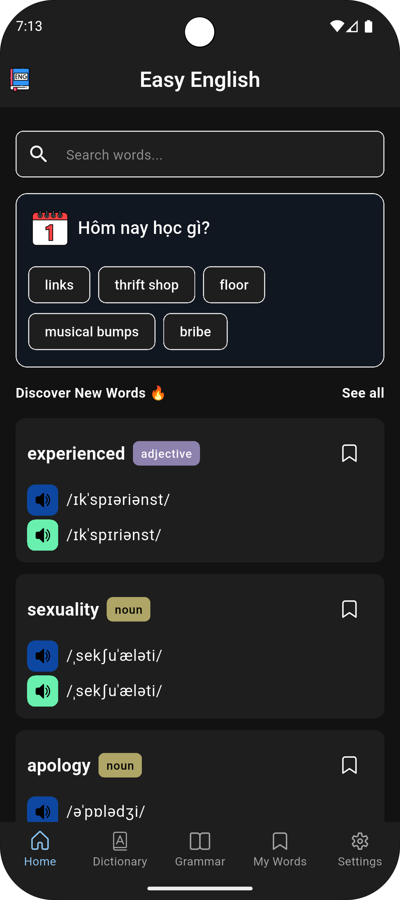 | 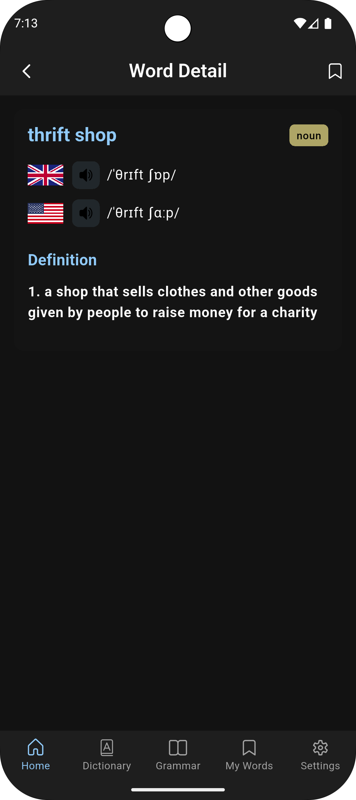  | 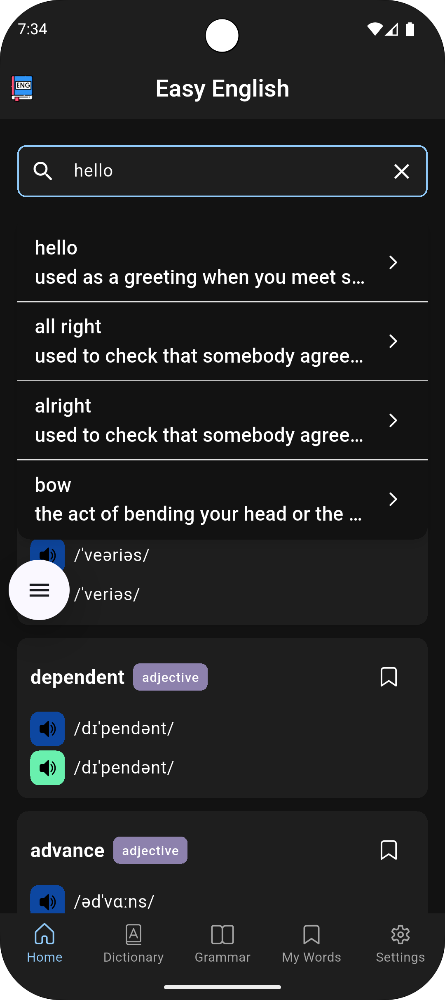  | 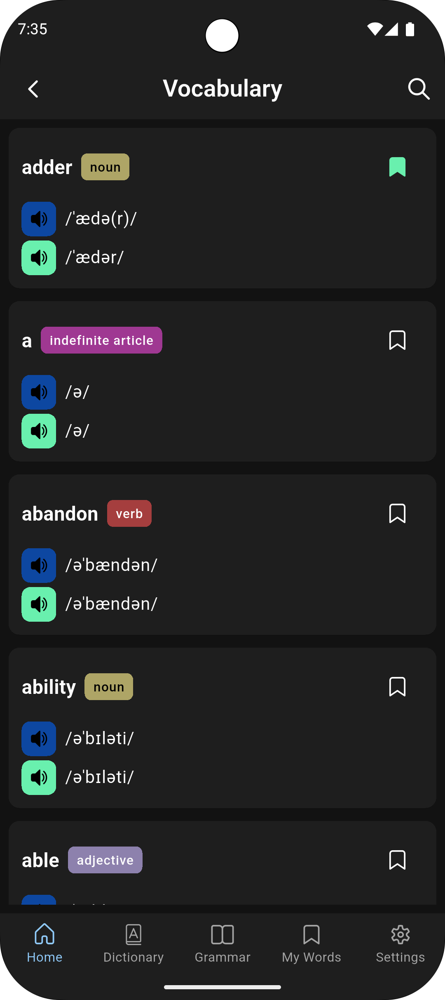  |
| 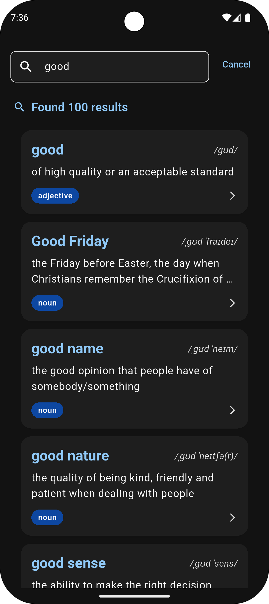 | 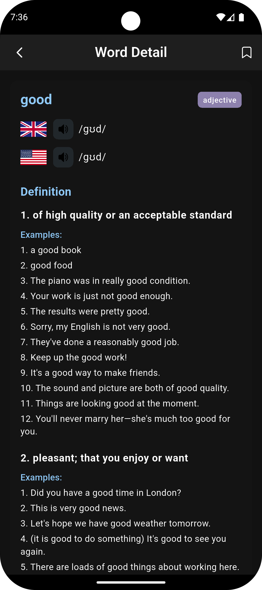  | 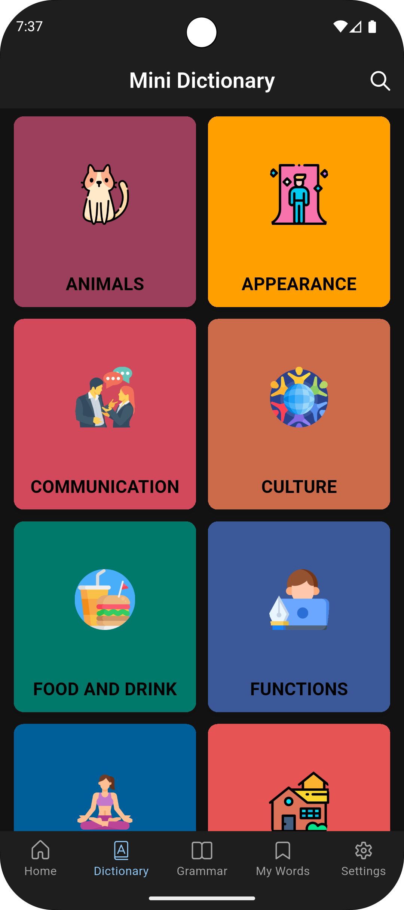  | 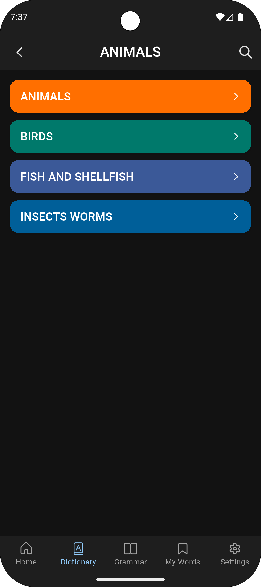  |
| 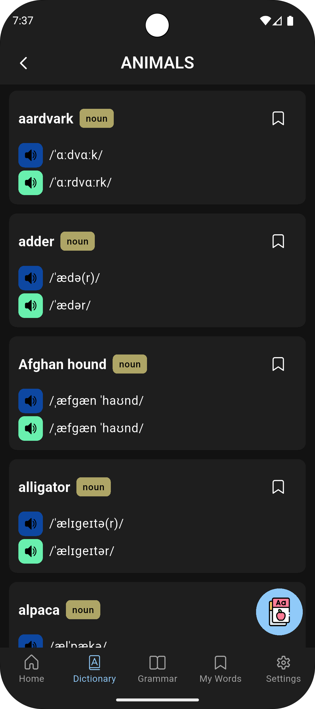 | 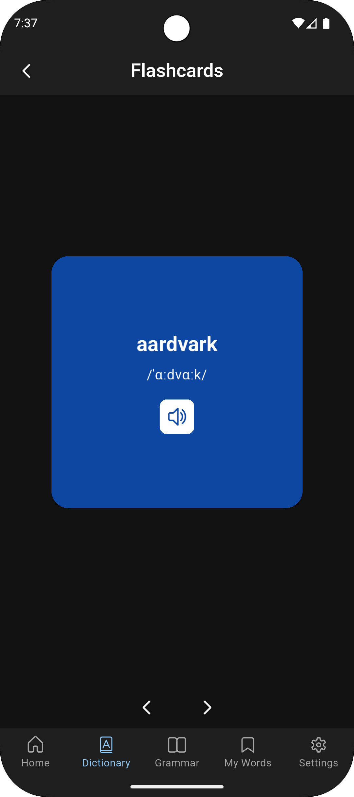  | 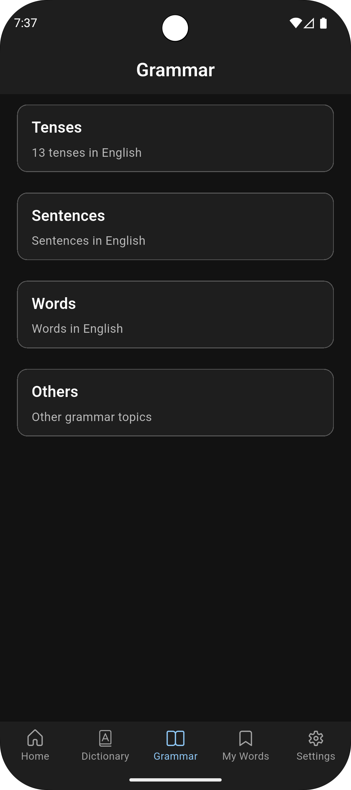  | 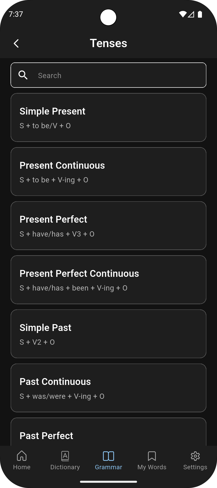  |
| 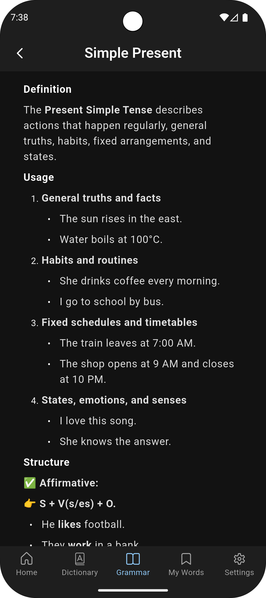 | 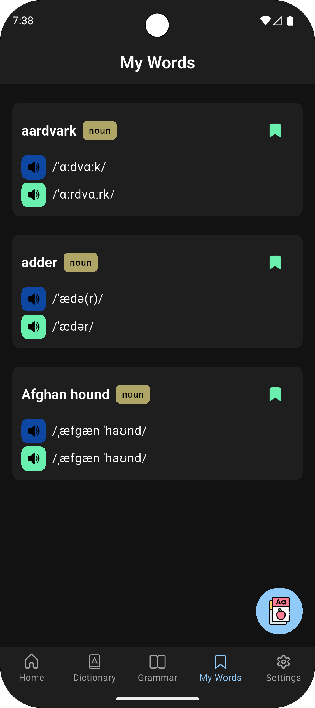  | 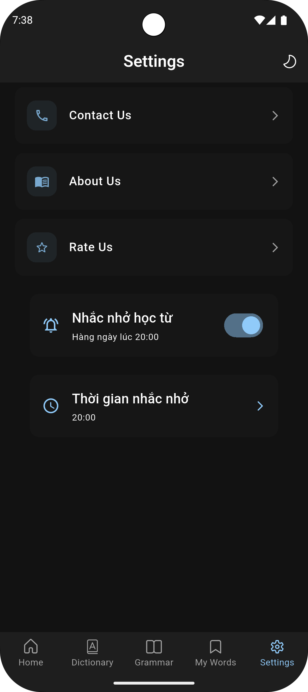  | 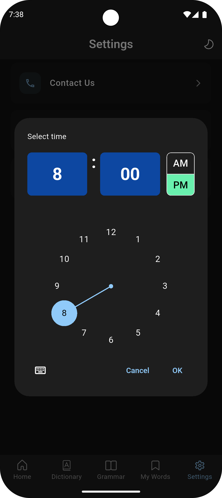  |
| 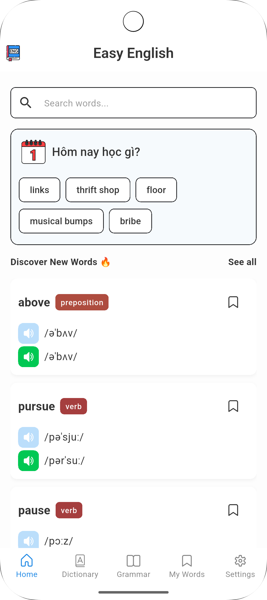 | 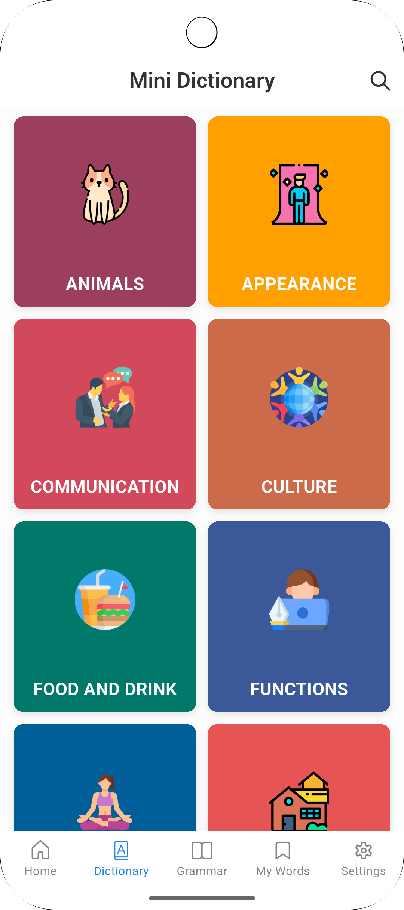  | 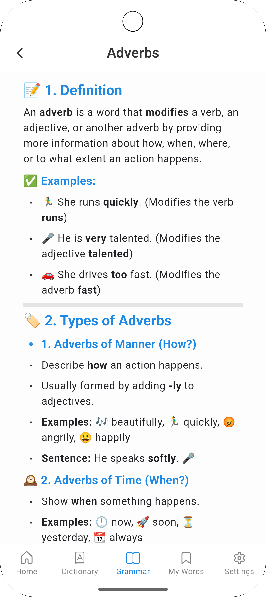  | 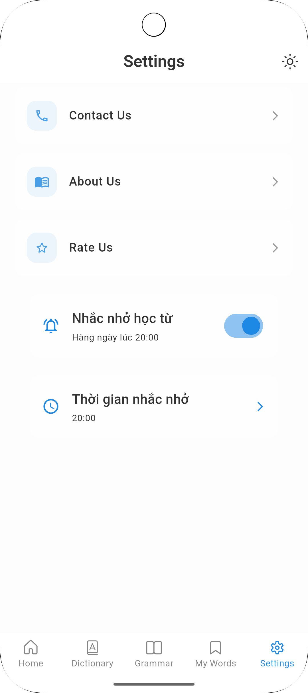  |

### 🏗️ The Complete Project Folder Structure
```text
lib/
├── core/              # Shared utilities and base configurations
│   ├── config/        # App-level configurations
│   ├── constants/     # Static values/constants
│   ├── errors/        # Custom error definitions and handlers
│   ├── mapper/        # Model ↔ Entity mappers
│   ├── navigation/    # Route definitions and navigation helpers
│   ├── register_module/ # Dependency registration per feature
│   ├── theme/         # Theme data and styling
│   └── utils/         # Helper functions, extensions, etc.
│
├── data/              # Data layer (implementation)
│   ├── datasources/   # Local or remote data sources (e.g., APIs, Hive, etc.)
│   ├── models/        # DTOs for network or database
│   └── repositories/  # Implementation of domain repositories
│
├── di/                # Dependency Injection
│   ├── injector.dart
│   └── injector.config.dart
│
├── domain/            # Business logic (abstract)
│   ├── entities/      # Core business entities (Word, Reminder, etc.)
│   ├── repositories/  # Abstract repository interfaces
│   └── usecases/      # Application-specific business rules
│
├── presentation/      # UI layer
│   ├── bindings/      # Route bindings
│   ├── features/      # UI features split by domain
│   │   ├── dictionary/
│   │   ├── flashcard/
│   │   ├── grammar/
│   │   ├── home/
│   │   ├── notifications/
│   │   ├── onboarding/
│   │   ├── search/
│   │   ├── settings/
│   │   ├── studing/
│   │   ├── theme/
│   │   ├── topics/
│   │   ├── translate/
│   │   └── vocabulary/
│   └── observers/     # BlocObserver for debugging & logging
│
├── my_app.dart        # Root widget with MaterialApp and Router
└── main.dart          # Entry point
```


## 🚀 Features

🗓️ **Daily Vocabulary**
   - Displays a new set of English words every day to help users expand their vocabulary.
   - Users can save, bookmark, or review learned words.
   - Flexible reminder settings allow users to customize study times.
   
🧩 **Thematic Word Lists**
   - Vocabulary is categorized into popular themes: Family, Travel, Work, etc.
   - Users can easily select topics relevant to their learning goals.

🔍 **Vocabulary Discovery**
   - Offers curated or randomized word lists for exploration.
   - Each word includes definitions, examples, pronunciations, and related terms.
   - One-tap access to detailed word information.

📘 **Grammar Learning by Topic**
   - Grammar is divided into four main categories:
   - Tenses – Covers all 13 English tenses.
   - Sentences – Sentence structures and usage.
   - Words – Nouns, verbs, adjectives, adverbs, etc.
   - Others – Additional grammar topics.

🧠 **Interactive Flashcards**
   - Learn vocabulary and grammar using flip cards.
   - Cards display meanings, pronunciations, examples, and illustrations.
   - Includes a review mode for reinforcing learned content.

🔎 **Powerful Word Search**
   - Smart search box for quickly finding English words.
   - Instant results with definitions, examples, and usage details.
   - Easy navigation to detailed word pages.

⏰ **Custom Study Schedule & Reminders**
   - Users can define how many words to learn per day and set a preferred study time.
   - App sends notifications based on the custom schedule.

💡 **User-Friendly Interface**
   - Clean, modern design with intuitive navigation.
   - Supports both light and dark modes.
   - Optimized for various screen sizes.

📴 **Offline Support**
   - Core features and vocabulary data are available without an internet connection.
   
⚙️ **Technology & Performance**
   - Built with Flutter, ensuring smooth performance on both Android and iOS.
   - Efficient state management (e.g., Bloc) for a seamless experience.
   - Uses local storage to protect privacy and ensure fast access.

### 📐 Architecture
The application follows a clean Layered (Clean) Architecture with clear separation between Presentation, Domain, and Data layers. It uses the Bloc state management pattern and leverages Flutter’s declarative UI for building responsive cross-platform interfaces.

This design ensures scalability, testability, and maintainability, allowing each feature to be developed, tested, and maintained independently.

## 📦 Installation
1. Clone the repository:
   ```bash
   git clone https://github.com/QDuyPhan/easy_english.git
   ```
2. Navigate to the project directory:
   ```bash
   cd easy_english
   ```
3. Install dependencies:
   ```bash
   flutter pub get
   ```
4. Run the app:
   ```bash
   flutter run
   ```

## 📄 License

This project is licensed under the [`MIT License`](LICENSE).

```text
MIT License
Copyright (c) 2025 Phan Quang Duy
```